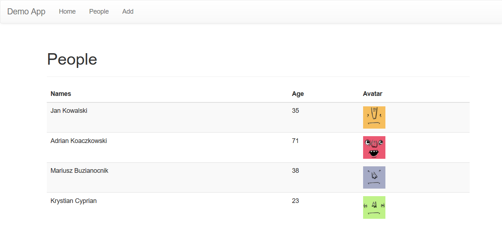
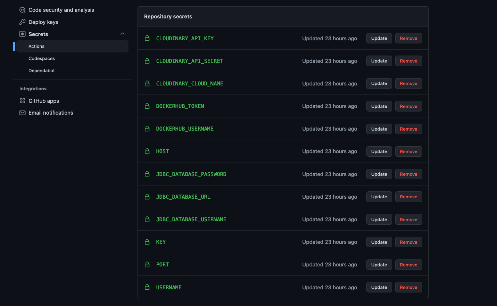
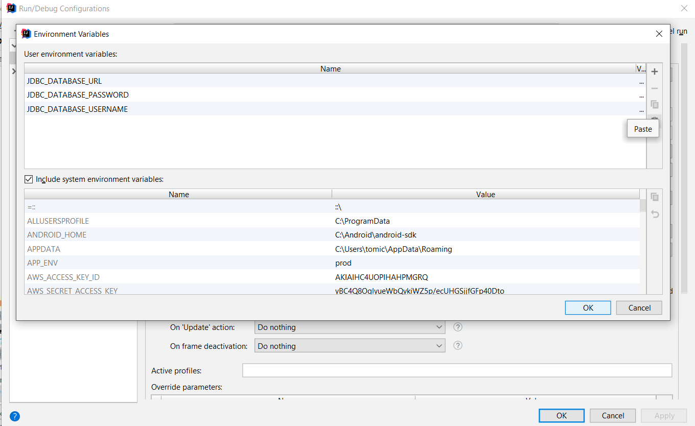
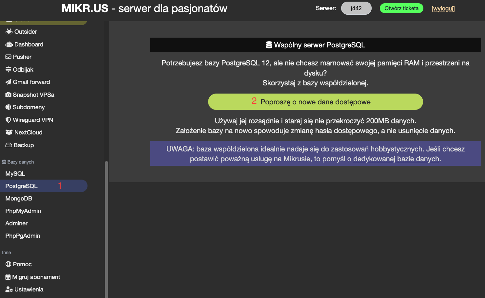
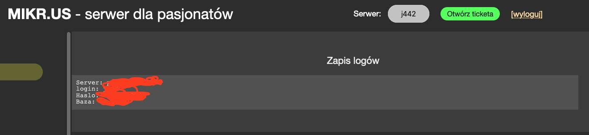
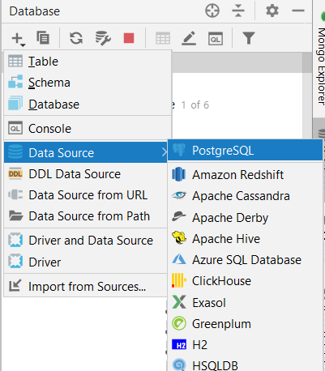
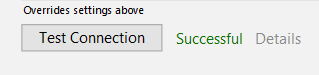
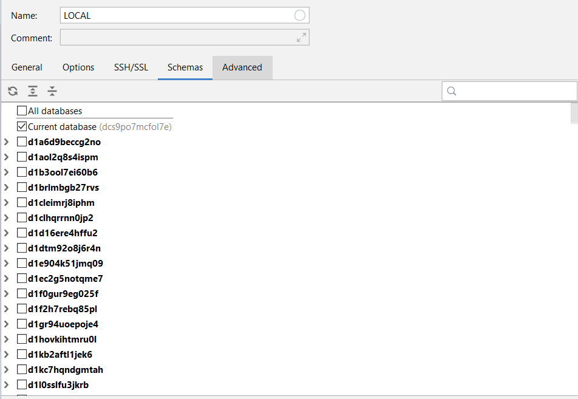
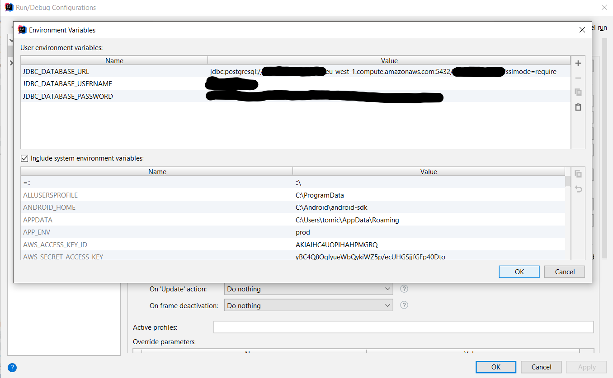
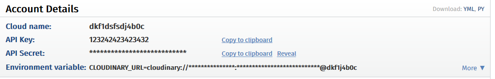

# Spring Boot Mikrus Flyway Demo Application



Simple example project showing how to connect:
 * [Spring Boot App](https://spring.io/projects/spring-boot)
 * [Mikrus Hosting](https://mikr.us)
 * [Postgres Mikrus Database](https://mikr.us)
 * [Flyway library](https://flywaydb.org/) used as database versioning tool.
 * [Thymeleaf + Thymeleaf Templates](https://www.thymeleaf.org/)


# Demo
Application is available here 


# Deploying app to Mikrus

Deployment uses GitHub Actions defined in [build.yml](.github/workflows/build.yml) file.

Following secrets are required in repository settings section (example: [https://github.com/kodujmy/mikrus-db-demo/settings/secrets/actions](https://github.com/kodujmy/mikrus-db-demo/settings/secrets/actions)):




# Local Development

Fill right secrets in file and paste it to your IDE or provide via env. variables.

## Configure elephantsql database

This can be usefull for local development purposes, when we don't want to configure database localy. 

1. Create account and database instance on [https://www.elephantsql.com/](https://www.elephantsql.com/)
2. Prepare following env values:
```
JDBC_DATABASE_URL=jdbc:postgresql://rogue.db.elephantsql.com:5432/abcdefgh
JDBC_DATABASE_PASSWORD=1234qwerweeweweedwr_4321gdfgdfdgd
JDBC_DATABASE_USERNAME=abcdefgh
```
3. Paste them in env window in your IntelliJ IDE

4. Run your app.

## Conecting to database from IDE

In case you want to create database for local purposes, follow below steps:

1. Create database using option in [Mikrus Panel](https://mikr.us/panel/)



2. Open credential page for newly created database.



3. Now setup connection to your database, using obtained credentials.



This is expected format for your IntelliJ connection
```
jdbc:postgresql://ec2-ho-stn-num-bers.eu-west-1.compute.amazonaws.com:5432/database_name?sslmode=require
```
4. If everything is setup correctly, green *Success* message should appear.



5. Go to your schema tab, and check your database schema.


6. Setup your configuration in environment variables as following:


## Cloudinary service integration

Application uses third party service responsible for storing images.

1. Go to [https://cloudinary.com/](https://cloudinary.com/) and register account.
2. Get credentials to your storage.

3. You need to provide following configuration to make it working:
```
CLOUDINARY_CLOUD_NAME=cloudname
CLOUDINARY_API_KEY=apikeyapikey
CLOUDINARY_API_SECRET=secretsecretsecretsecret
```
4. Include it in your environments before running app the same way, you do for DB.
